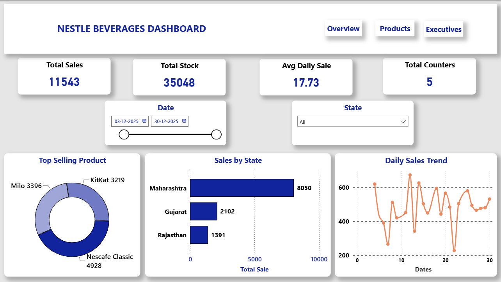
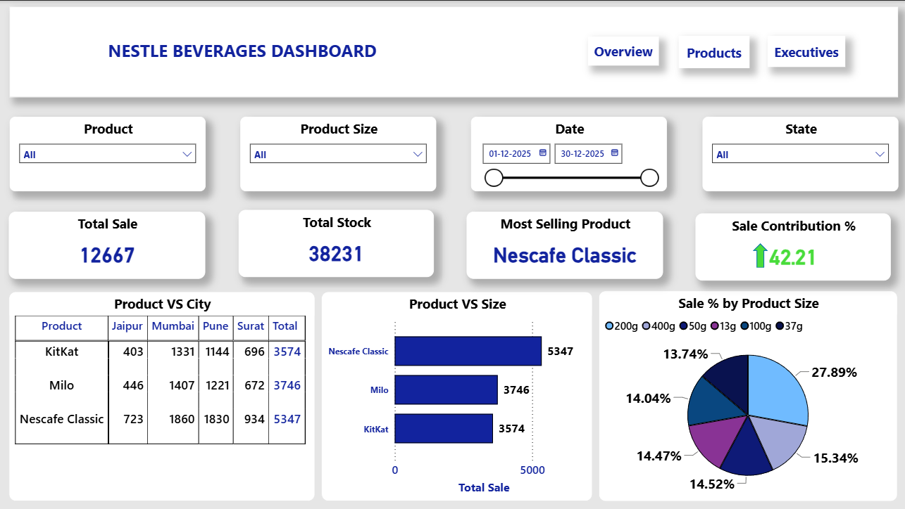
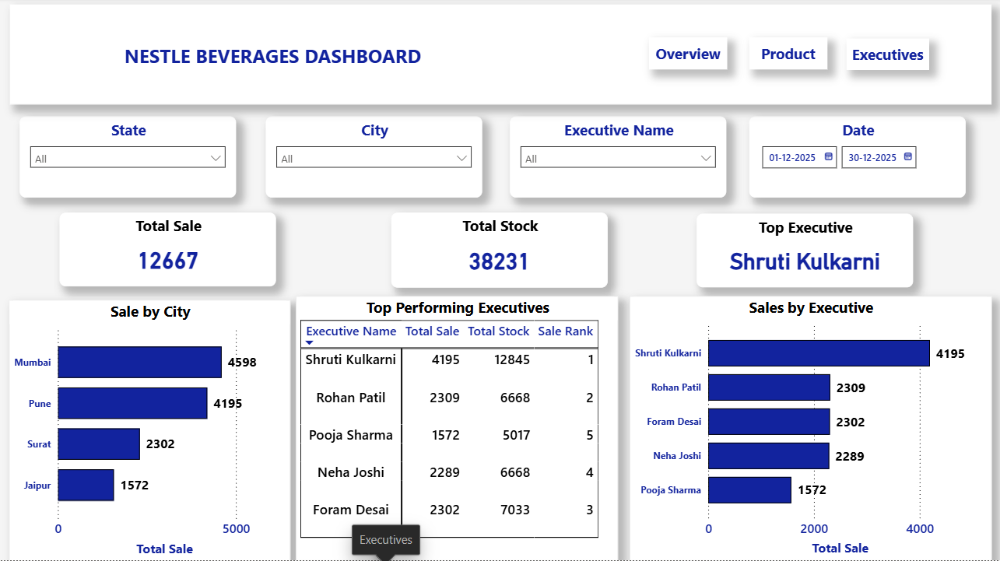

# 📊 CodeAlpha Data Visualization Project

## Interactive Sales Dashboard using Power BI

### Project Overview
Developed an interactive Power BI dashboard to analyze sales performance, product performance, inventory, and executive performance.

### Features
- Interactive slicers (Date, Product, State, Executive)
- KPI Cards
- Sales Trend Analysis
- Product-wise Sales Analysis
- Executive Performance Analysis
- Inventory Monitoring

### Tools Used
- Power BI
- Power Query
- DAX
- Microsoft Excel

## Dashboard Screenshots

(Add your screenshots here after uploading them.)

## Author
Omkar Kurane

### Dashboard Screenshots

### Sales Overview

### Product Analysis

### Executive Performance

